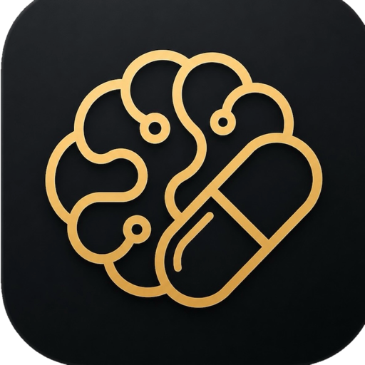
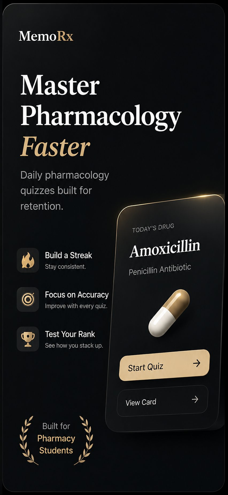
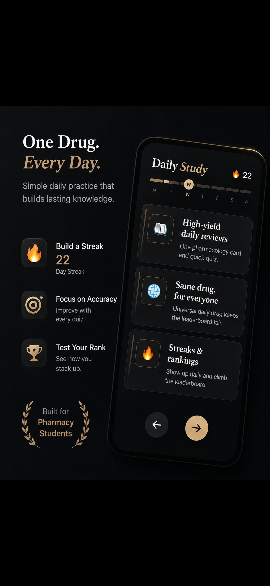
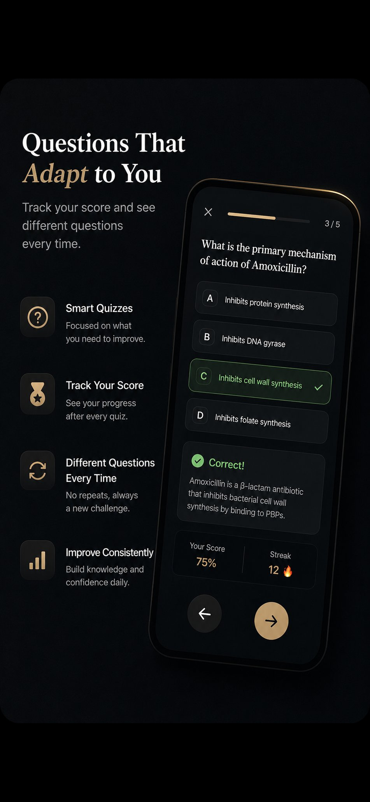

<div align="center">



# MemoRx

**Pharmacology board prep that adapts to what you keep forgetting.**

*A NAPLEX study app for pharmacy students. One drug a day, quizzed until it sticks.*


<a href="https://apps.apple.com/us/app/memorx-naplex-drug-prep/id6761398713">
  
</a>

</div>

---

## The idea

MemoRx gives you one drug a day.

You open it, read the card, answer a short quiz, and you are done in about four minutes. That is the whole daily ask. It fits between classes or on the bus, so it survives a rotation week where an hour of studying would not.

The part you do not do yourself is the schedule. Drugs you got shaky on come back on their own, days or weeks later, before you would have lost them. Over eight months that adds up to a couple hundred drugs you still know in May.

Everyone gets the same drug on the same day, which is what keeps the leaderboard fair and the studying social. And the dataset is hand-built rather than scraped, because a wrong mechanism of action in a study app is worse than no study app.

---

## Screenshots

<div align="center">





<sub>Daily drug · Streaks & daily study · Adaptive quizzing</sub>

</div>

---

## What's inside

<table>
<tr><td width="30%"><b>201 drugs</b></td><td>Hand-curated, not scraped. Each one carries 16 structured fields.</td></tr>
<tr><td><b>21 collections</b></td><td>Therapeutic areas: pain &amp; fever, cardiovascular, endocrine, infectious disease, psych, and more.</td></tr>
<tr><td><b>104 sub-collections</b></td><td>The level where real distinctions live: non-opioid analgesics vs. opioids, not just "pain."</td></tr>
<tr><td><b>16 fields per drug</b></td><td>Including mechanism, indications, contraindications, interactions, side effects, warnings, monitoring, dosage, counseling points, and clinical pearls.</td></tr>
</table>

---

## Drug data pipeline

Every drug in MemoRx starts as public clinical information and ends as a structured, validated record ready to generate quiz questions.

```
Drugs.com / MedlinePlus
        ↓
   extraction + normalization
        ↓
   16-field structured schema
   (mechanism, indications, contraindications,
    interactions, side effects, warnings,
    monitoring, dosage, counseling, pearls, ...)
        ↓
   validation pass
   (cross-reference sources, flag conflicts,
    human review on every record)
        ↓
   Supabase Postgres
   (drugs → collections → sub-collections)
        ↓
   competency system
   (per-user mastery state per drug,
    SM-2 scheduling, difficulty tracking)
        ↓
   adaptive learning / tutor
   (question generation across fields,
    drug-specific vs. class-level mixing,
    spaced resurfacing based on decay)
```

The pipeline is deliberately not fully automated. Source material gets pulled from Drugs.com and MedlinePlus, normalized into the 16-field schema, then validated, cross-referencing between sources and flagging anything that conflicts before a human signs off. Automation handles the boring parts (formatting, deduplication, schema conformance); judgment calls stay manual. A wrong mechanism of action or a missing contraindication in a board prep app isn't a data quality issue, it's a liability.

Once a drug record lands in Supabase, the competency system picks it up. Each user carries their own mastery state per drug: how many times they've seen it, how they rated it, when it's due again. That feeds the adaptive layer, which decides what to quiz, at what altitude (single-drug recall vs. cross-class reasoning), and when to resurface something that's about to slip.

---

## How the quizzing works

The engine treats a drug as something you have a decaying grip on, not a card you have or haven't flipped.

**Spaced repetition.** An SM-2 inspired scheduler tracks per-drug mastery and surfaces each drug just before the point it would be forgotten. Rating a drug as hard pulls it forward; getting it right repeatedly pushes it out.

**Two question altitudes.** Roughly 70% of questions are drug-specific ("what is the mechanism of amoxicillin?") and 30% are class-level ("which of these is *not* a beta-lactam?"). Drug-specific questions build recall; class-level questions build the comparative reasoning boards actually test.

**No repeats.** Questions are generated across the drug's structured fields and shuffled per attempt, so a second pass through the same drug is a genuinely different quiz rather than a memorized answer position.

**Difficulty is yours, not global.** Each user carries their own difficulty rating per drug, which feeds back into scheduling weight.

---

## Architecture


**Cloud-first, offline-tolerant.** The app asks Supabase for content on launch. If the network fails or returns empty, it falls back to the last cached copy, then to JSON bundled in the binary, so a student on a hospital floor with no signal still gets their quiz.

**Server-authoritative progress.** Streaks, XP, and milestones are computed server-side rather than trusted from the device. A client that lies about its streak does not get a streak.

**Receipts are verified, not decoded.** Subscription state is validated server-side against Apple's signed payloads with full certificate-chain verification anchored to Apple's root CA, not by reading the claims and hoping.

---

## Design principles

<table>
<tr><td width="34%"><b>Correctness over volume</b></td><td>201 drugs a pharmacist would sign off on beats 2,000 scraped ones. Every field is reviewed; wrong pharmacology in a study app is actively harmful.</td></tr>
<tr><td><b>One drug a day</b></td><td>The unit of study is a day, not a session. Small, finishable, repeatable. The schedule does the work so motivation does not have to.</td></tr>
<tr><td><b>Studying works offline</b></td><td>Content is cached and bundled. Signal is not a prerequisite for review.</td></tr>
<tr><td><b>Restrained by default</b></td><td>Black and gold, serif headings, generous space. A study tool should feel calm and serious, not gamified into noise. The streak counter is the loudest thing on screen and that is deliberate.</td></tr>
<tr><td><b>Health-adjacent privacy</b></td><td>No user identifiers in crash telemetry, anonymous sessions supported, account deletion is a first-class action rather than an email request.</td></tr>
<tr><td><b>Fair competition</b></td><td>Everyone gets the same drug on the same day. The leaderboard measures consistency, not who found the easiest deck.</td></tr>
</table>

---

## Project log

Shipping since June 2026. Source lives in a private repository; this is the shape of the work.

### ☁️ June 2026: release and backend foundation

**v1.0 reaches the App Store.** The month's real work is underneath it: the Supabase layer gets its foundation laid properly, with 73 migrations and the edge function sources archived as a known-good state rather than left to drift between the dashboard and the repo.

The rest is early production reality: subscription sync bugs found and fixed, and a silent fallback removed from the drug fetch path so real backend errors surface instead of quietly resolving to nothing.

### 🔐 July 2026: trust and testing

A month spent almost entirely on making the backend trustworthy rather than adding features.

Receipt verification moved to genuine signed-payload validation. A full audit pass swept the Supabase layer end to end: edge functions redeployed, scheduled jobs gated, weekly leaderboard archival corrected, with tests added behind it.

Nothing a user would notice, which is rather the point: the parts of the app that handle money and rankings are the parts that most need to be boring and correct.

### 📚 August 2026: the study engine deepens

The busiest month, and the one where MemoRx stopped being a daily drug card and became a study system.

**Exam prep** arrives in two passes: onboarding first, then the substance: a concept taxonomy, a progressive diagnostic, learning-evidence tracking, and a generated plan for the day. Onboarding is reworked alongside an expanded therapeutic class system.

Entitlements move to a server-side lease with an ownership ledger, closing out the trust work July started.

The month also produces a small side system: **the app learned to film its own marketing videos.** A debug launch flag replaces MemoRx with a scripted run (real views, real content, no one touching the Simulator) and writes the caption alongside the footage. That one is public, source and all:

> 🎬 **[memorx-market-capture](https://github.com/ctxako/memorx-market-capture)**: the capture system, plus the artifacts from one real run.

---

## What it isn't

An AI question generator · a scraped drug database · a flashcard app with a pharmacology skin · a social network · a clinical reference for practice · free forever

---

## North Star

> A student opens MemoRx for four minutes a day for eight months, and walks into the NAPLEX having genuinely retained two hundred drugs, without ever having built a study schedule themselves.

---

<div align="center">

**Source is private.** This repository is a showcase of the work, its architecture, and its design.

<a href="https://apps.apple.com/us/app/memorx-naplex-drug-prep/id6761398713">
  
</a>

<br/><br/>

<sub>Built by <a href="https://github.com/ctxako">@ctxako</a></sub>

</div>
