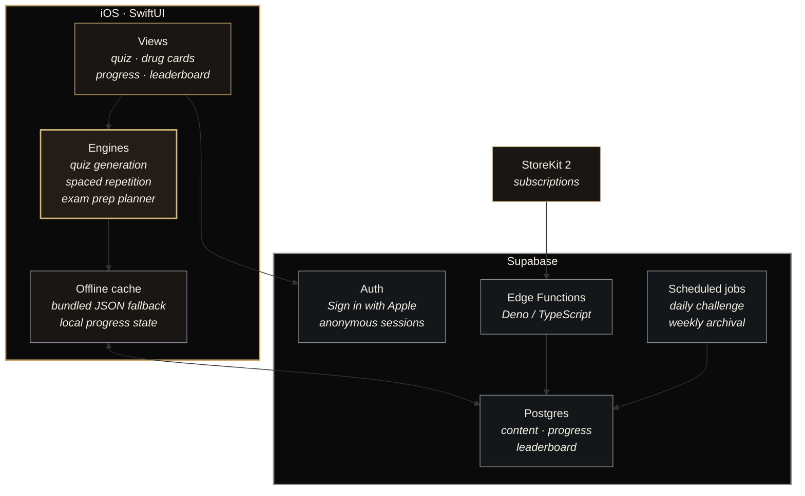

<div align="center">


# MemoRx

**Pharmacology board prep that adapts to what you keep forgetting.**

*A NAPLEX study app for pharmacy students. One drug a day, quizzed until it sticks.*


<a href="https://apps.apple.com/us/app/memorx-naplex-drug-prep/id6761398713">
  
</a>

</div>

---

## The idea

MemoRx gives you one drug a day.

You open it, read the card, answer a short quiz, and you are done in about four minutes. That is the whole daily ask. It fits between classes or on the bus, so it survives a rotation week where an hour of studying would not.

The part you do not do yourself is the schedule. Drugs you were shaky on come back days or weeks later, before you would have lost them. Over eight months that adds up to a couple hundred drugs you still know in May.

Everyone gets the same drug on the same day, which keeps the leaderboard comparable. The dataset is hand-built rather than scraped, because a wrong mechanism of action in a study app is worse than no study app.

---

## Screenshots

<div align="center">


<sub>Daily drug · Streaks & daily study · Adaptive quizzing</sub>

</div>

---

## What's inside

<table>
<tr><td width="30%"><b>201 drugs</b></td><td>Hand-curated, not scraped. Each one carries 16 structured fields.</td></tr>
<tr><td><b>21 collections</b></td><td>Therapeutic areas: pain &amp; fever, cardiovascular, endocrine, infectious disease, psych, and more.</td></tr>
<tr><td><b>104 sub-collections</b></td><td>Where the distinctions that matter sit: non-opioid analgesics vs. opioids, not just "pain."</td></tr>
<tr><td><b>16 fields per drug</b></td><td>Including mechanism, indications, contraindications, interactions, side effects, warnings, monitoring, dosage, counseling points, and clinical pearls.</td></tr>
</table>

---

## Drug data pipeline

Every drug in MemoRx starts as public clinical information and ends as a structured, validated record ready to generate quiz questions.

```
Drugs.com / MedlinePlus
        ↓
   extraction + normalization
        ↓
   16-field structured schema
   (mechanism, indications, contraindications,
    interactions, side effects, warnings,
    monitoring, dosage, counseling, pearls, ...)
        ↓
   validation pass
   (cross-reference sources, flag conflicts,
    human review on every record)
        ↓
   Supabase Postgres
   (drugs → collections → sub-collections)
        ↓
   competency system
   (per-user mastery state per drug,
    SM-2 scheduling, difficulty tracking)
        ↓
   adaptive learning / tutor
   (question generation across fields,
    drug-specific vs. class-level mixing,
    spaced resurfacing based on decay)
```

The pipeline is deliberately not fully automated. Automation handles formatting, deduplication, and schema conformance; every record is cross-referenced between sources, conflicts are flagged, and a human signs off. A wrong mechanism of action or a missing contraindication in a board prep app is not a data quality issue, it is a liability.

Once a record lands in Supabase, the competency system picks it up. Each user carries their own mastery state per drug: how often they have seen it, how they rated it, when it is due again. That feeds the adaptive layer, which decides what to quiz, at what level, and when to resurface something that is about to slip.

---

## Custom quiz engine

The engine tracks a drug as a decaying level of recall rather than a card you have or have not flipped.

**Spaced repetition.** An SM-2 inspired scheduler tracks per-drug mastery and surfaces each drug shortly before it would be forgotten. Rating a drug as hard pulls it forward; answering correctly pushes it out.

**Two question levels.** Roughly 70% of questions are drug-specific ("what is the mechanism of amoxicillin?") and 30% are class-level ("which of these is not a beta-lactam?"). The first builds recall, the second builds the comparative reasoning the boards test.

**No repeats.** Questions are generated across the drug's structured fields and shuffled per attempt, so a second pass is a different quiz rather than a memorized answer position.

---

## Architecture



**Cloud-first, offline-tolerant.** The app asks Supabase for content on launch. If the network fails or returns empty, it falls back to the last cached copy, then to JSON bundled in the binary, so a student on a hospital floor with no signal still gets their quiz.

**Server-authoritative progress.** Streaks, XP, and milestones are computed server-side rather than trusted from the device.

**Receipt verification.** Subscription state is validated server-side against Apple's signed payloads, with certificate-chain verification anchored to Apple's root CA rather than by reading the claims.

---

## Design principles

**Correctness over volume.** 201 reviewed drugs rather than 2,000 scraped ones. Wrong pharmacology in a study app is actively harmful.

**The unit of study is a day.** Small, finishable, repeatable, with the schedule doing the work instead of motivation. Content is cached and bundled, so signal is not a prerequisite for review.

**Restrained by default.** Black and gold, serif headings, generous space. A study tool should read as calm and serious rather than gamified. The streak counter is the loudest thing on screen and that is deliberate.

**Privacy and fairness.** No user identifiers in crash telemetry, anonymous sessions supported, and account deletion is an action in the app rather than an email request. Everyone gets the same drug on the same day, so the leaderboard measures consistency.

---

## Project log

**June 2026.** v1.0 reaches the App Store. Underneath it, the Supabase layer gets its foundation laid: 73 migrations and the edge function sources archived as a known-good state rather than left to drift between the dashboard and the repo. Subscription sync bugs fixed, and a silent fallback removed from the drug fetch path so backend errors surface instead of resolving to nothing.

**July 2026.** Backend trust work rather than features. Receipt verification moved to signed-payload validation, and an audit pass across the Supabase layer: edge functions redeployed, scheduled jobs gated, weekly leaderboard archival corrected, tests added behind it.

**August 2026.** Exam prep arrives: a concept taxonomy, a progressive diagnostic, learning-evidence tracking, and a generated plan for the day, with onboarding reworked alongside an expanded therapeutic class system. Entitlements move to a server-side lease with an ownership ledger.

The same month produced a side system: a debug launch flag replaces the app with a scripted run against real views and content, records it, and writes the caption alongside the footage. That one is public, source included: [memorx-market-capture](https://github.com/ctxako/memorx-market-capture).

---

## Stack

Swift 6 · SwiftUI · StoreKit 2 · Supabase (Postgres, Auth, Edge Functions on Deno, scheduled jobs) · Sign in with Apple · bundled JSON offline fallback

---

## The goal

A student opens MemoRx for four minutes a day for eight months and walks into the NAPLEX having retained two hundred drugs, without ever having built a study schedule.

---

<div align="center">

**Source is private.** This repository documents how it is built.

<a href="https://apps.apple.com/us/app/memorx-naplex-drug-prep/id6761398713">
  
</a>

<br/><br/>

<sub>Built by <a href="https://github.com/ctxako">@ctxako</a></sub>

</div>
